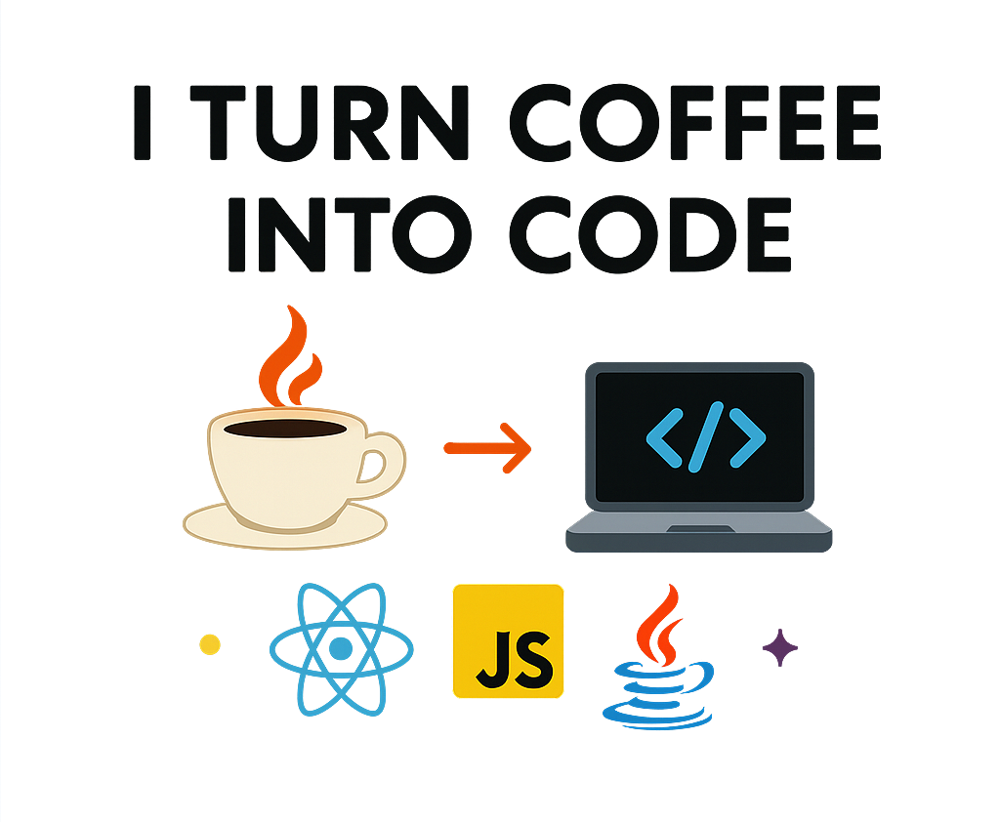
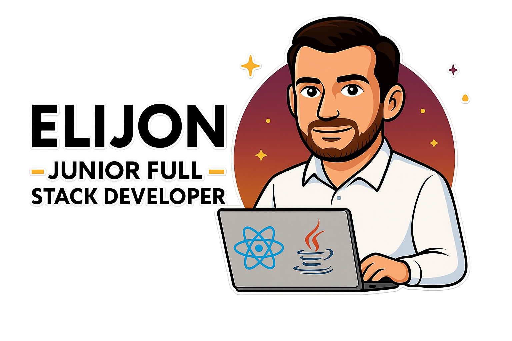

  
# Ciao 👋, sono Elijon!

### From Restaurant to REST API 🍝 → 💻

---

### 🚀 Tech Stack

- ⚛️ Front-End: **JavaScript**, **React**, **Redux**, **Bootstrap**, **Sass**
- ☕ Back-End: **Java**, **Spring Boot**
- 🐘 Database: **PostgreSQL**
- ☁️ Altri strumenti: **Cloudinary**, **Email Service Sender**,

---

### 🔍 Progetti in Evidenza

#### 🍽️ [frontend-capstone-eglerestaurant](https://github.com/Elijon-Laska/frontend-capston-eglerestaurant)

App responsive per ristorante costruita in **React + Redux**, interfaccia moderna e UX intuitiva.  
Permette agli utenti di prenotare, scoprire i piatti e navigare in una piattaforma dinamica.

#### 🔧 [backend_Capstone_EgleRestaurant](https://github.com/Elijon-Laska/backend_Capstone_EgleRestaurnat)

REST API realizzata in **Java + Spring Boot** per gestire utenti, prenotazioni, piatti ed esperienze.  
Include funzionalità avanzate come gestione immagini via **Cloudinary** e invio notifiche via mail.

🎓 Entrambi fanno parte del mio **Capstone Project** per la fine del corso _Full Stack Developer_ presso **Epicode**.

---

### 🎯 Obiettivi per il 2025

Trovare un’azienda solida e stimolante dove crescere professionalmente, collaborare in team dinamici e contribuire con passione e competenza.

---

### 📚 Cosa sto studiando ora

- Approfondimento su **Angular**, **Node.js** e **TypeScript**
- Testing front-end e back-end
- Scrittura di codice più scalabile e manutenibile

---

### 🧠 Fun Fact su di me

Per 10 anni ho lavorato come **responsabile di sala** in un ristorante.  
Questa esperienza mi ha insegnato gestione, comunicazione e leadership.  
Poi ho riscoperto la mia vecchia passione per l’IT e ho deciso di **cambiare vita, imparando a programmare da zero.**

---

### 📊 GitHub Stats

  

---

### 🧑‍💻 Linguaggi più usati

  

---

### 🏆 GitHub Achievements

  

---

### 🔗 Link Utili

  
  
  
  

---

  💼 Sono pronto per nuove sfide!  
  📫 Contattami via email: <a href="mailto:laskaelijon95@gmail.com">laskaelijon95@gmail.com</a>
  📞 Chiamami: +39 388 750 5204

