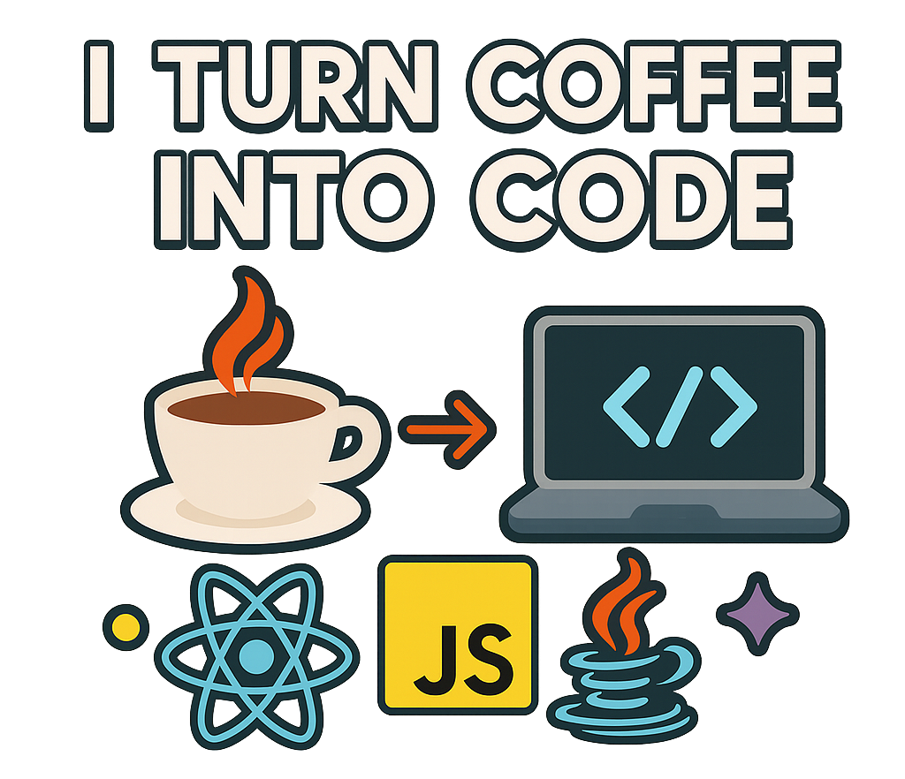

  

  <h1>Elijon Laska</h1>
  <h3>Full Stack Developer (Java | Spring Boot | React)</h3>

  

    <em>Ex Restaurant Manager turned Developer.</em> 
    Porto la gestione dello stress e l'organizzazione della sala nel codice backend.
  

  

    
    
    
  

 

  

---

### 🛠 Tech Stack & Tools

| **Domain** | **Technologies** |
| :--- | :--- |
| **☕ Backend** |     |
| **⚛️ Frontend** |        |
| **🗄️ Data** |    |
| **☁️ DevOps & Tools** |      |

---
