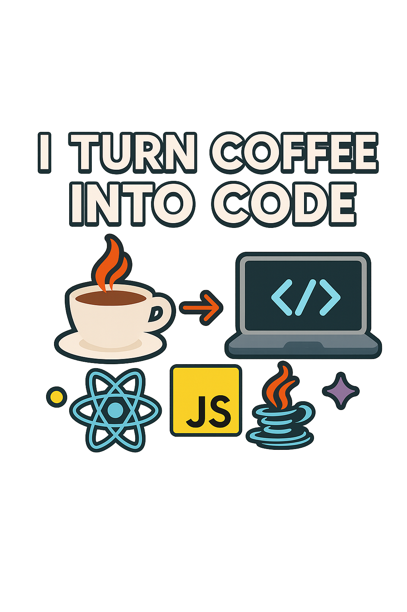

  

  # Elijon Laska
  ### Full Stack Developer (Java | Spring Boot | React)

  

    <em>Ex Restaurant Manager turned Developer.</em> 
    Porto la gestione dello stress e l'organizzazione della sala nel codice backend.
  

  

    
    
    
  

---

### 🛠 Tech Stack & Arsenal

Non elenco tutto ciò che ho toccato una volta, ma quello che uso in produzione.

| **Backend Core** | **Frontend Ecosystem** | **Data & DevOps** |
|:---:|:---:|:---:|
|  |  |  |
|  |  |  |
|  |  |  |

---

### 🏗 Selected Projects

#### 🍝 [Egle Restaurant Platform (Full Stack)](https://github.com/Elijon-Laska/backend_Capstone_EgleRestaurnat)
Un sistema completo di prenotazione e gestione ordini.
* **Architecture:** Monolithic architecture with RESTful exposition.
* **Backend:** Java 17, Spring Boot 3, Spring Security (JWT + RBAC).
* **Frontend:** React, Redux Toolkit, Axios interceptors.
* **Key Feature:** Integrazione Cloudinary per gestione media e notifiche email asincrone.

---

### 📊 GitHub Analytics

  

---

### ⚡ Why Me?
Passare da **Restaurant Manager** a **Developer** non è solo un cambio carriera, è un upgrade del mindset.
* **Gestione Risorse:** Prima gestivo turni e inventario, ora gestisco Thread e Memoria.
* **Problem Solving:** Ho risolto crisi con clienti urlanti; un NullPointerException non mi spaventa.
* **Focus:** Cerco ruoli backend/full-stack dove le architetture a microservizi siano lo standard, non l'eccezione.
